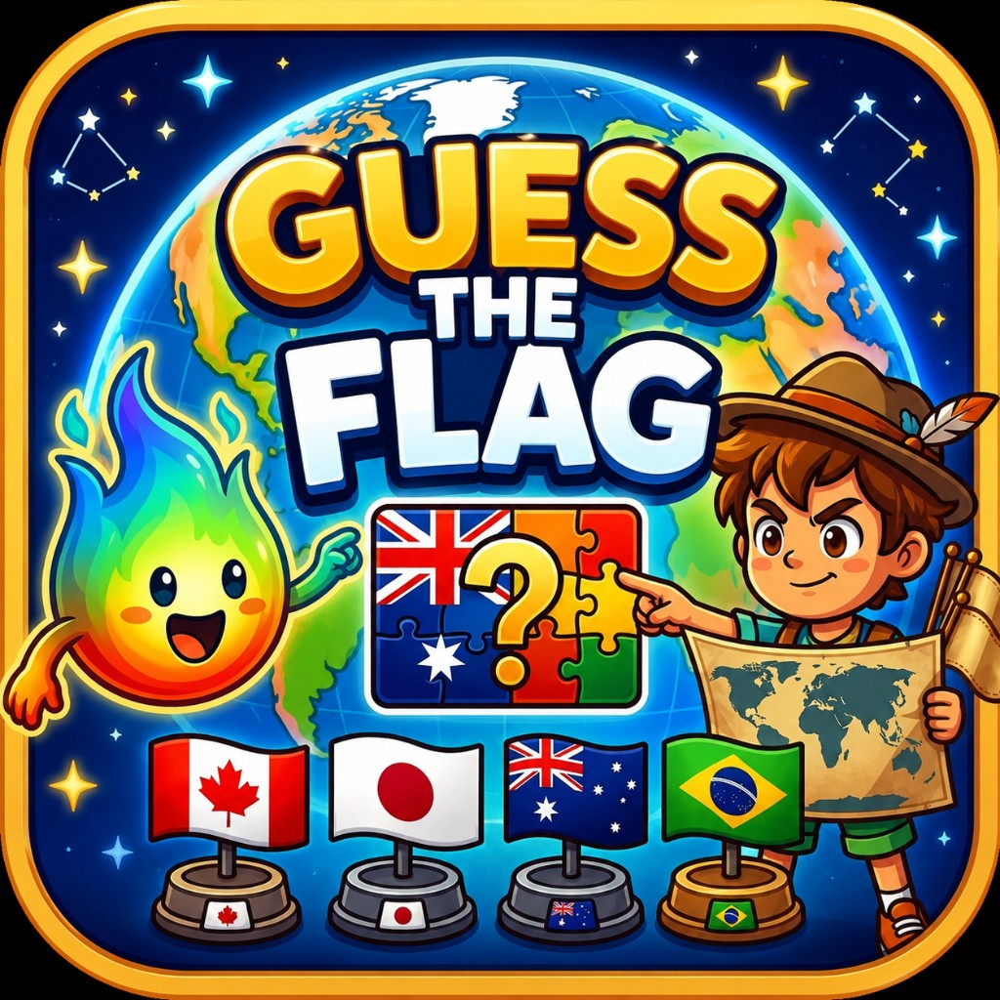
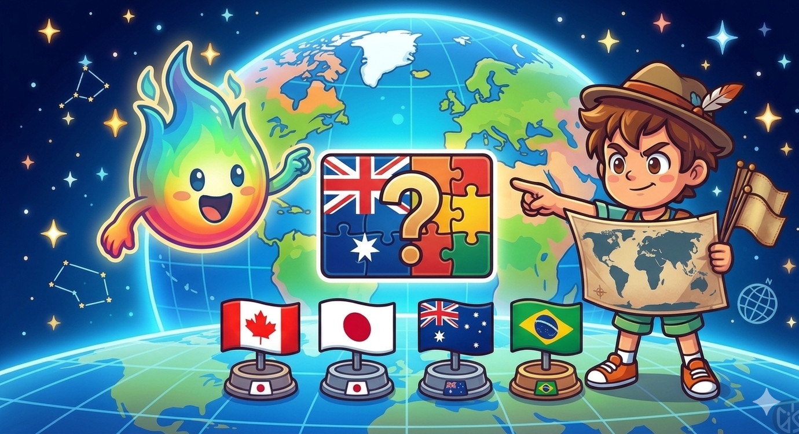
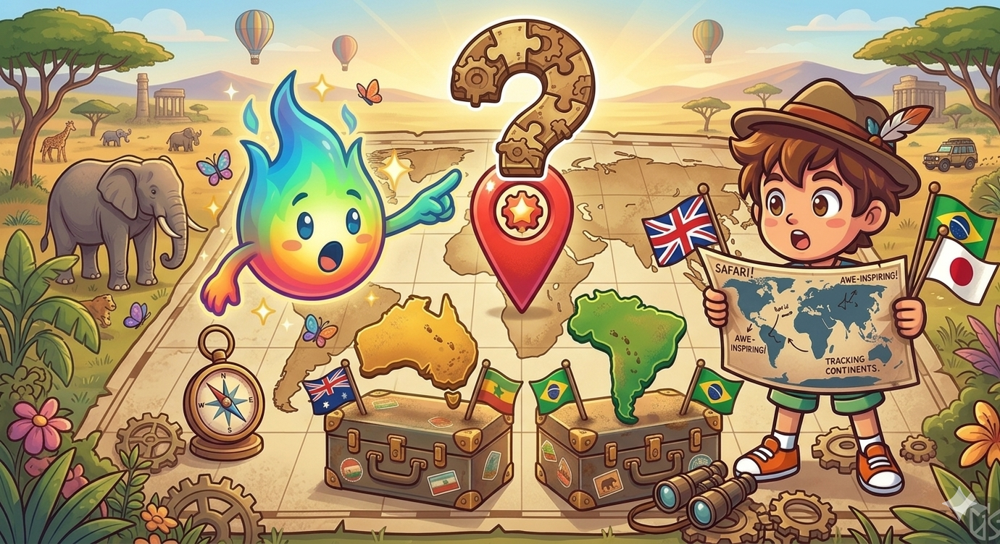
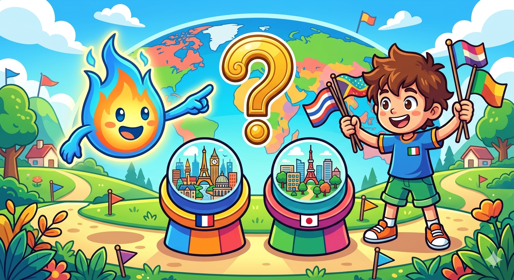

  

  # Guess The Flag 🌍

  **Test your world geography skills!**  
  Guess flags, countries, capitals, shapes and more.

  
  

---

## 🎮 Game Modes

| Mode | Description |
|------|-------------|
| 🏳️ **Guess the Flag** | See a country name, pick the correct flag from four options |
| 🌍 **Guess the Country** | Look at a flag and identify which country it belongs to |
| 🏛️ **Guess the Capital** | Name the capital city of each country shown |
| 🗺️ **Guess the Shape** | Identify a country just from its geographic outline |
| 🧠 **Memory Quiz** | Flip cards and match flags in this classic memory challenge |

---

## 📊 At a Glance

|  |  |
|--|--|
| 🌐 Flags | **250** from around the world |
| 🗺️ Continents | **6** — Africa, Americas, Asia, Europe, Oceania, Antarctica |
| 🏆 Achievements | **30+** via Google Play Games & Game Center |
| 🌍 Languages | **16** supported |
| 📱 Platforms | Android · iOS *(coming soon)* |

---

## 🃏 Card Collection System

Every flag you encounter is saved in your personal collection. The game tracks your progress automatically:

- ✅ **Learned** — Flags you identify without hesitation
- ⚡ **In Progress** — You're working on these, they'll appear more often
- 🔄 **To Review** — Needs a bit more practice

---

## 🖼️ Screenshots

  
  
    
  
  

---

## 🌐 Languages

The app is fully translated into **16 languages**:

`Arabic` `German` `Greek` `English` `Spanish` `French` `Hindi` `Indonesian` `Italian` `Japanese` `Korean` `Portuguese` `Russian` `Turkish` `Vietnamese` `Chinese`

---

## 📥 Download

---

  Made with ❤️ by Wispy Games &nbsp;·&nbsp; © 2026 All rights reserved

